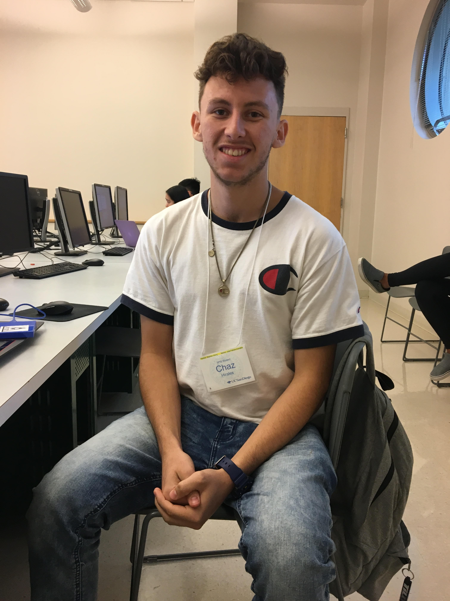

# practice-chaz-h
# I am Chaz Hirales, and I'm from Calipatria, CA, a very small town located in the Imperial Valley. I am hoping to learn how to code during SPIS. I make beats on my laptop, play basketball, and play a bit of soccer. During non-academic activities, I am excited to play pickup games in the recreational facilities, play table tennis, go to the beach, and participate in the Board Game Night. 

# 
